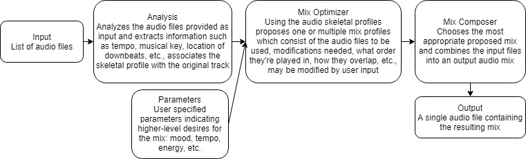

% MixList
% Josh Bean, Jeremy Cruz, Gerard Gaimari

<!-- Pandoc Markdown title -->

## Abstract

For decades DJs have been using turntables and mixers to create a **mixtape**, defined as a sequence of musical tracks mixed together as one continuous track. Traditionally, these mixtapes are made in real time, and possibly recorded, by a DJ who spends years honing their skills. Today, software has provided an alternative to analog mixers and physical interfaces but the technology has still primarily been used in specialized products for DJs/producers requiring many hours to start using let alone create a decent mixtape. MixList is a tool which gives anyone the ability to create a **mixtape** of professional DJ quality by providing a playlist of songs.

## Project Scenario and Goals

Say you are throwing a party with your roomates and have been assigned the daunting task of preparing music to keep everyone entertained. Maybe you have an important race coming up and are looking to sustain high energy so you can stay focused. Even if you’re yoga instructor searching for a calm, continuous flow of music to set the stage for peaceful meditation during the next class. 

MixList is your solution, simply provide a group of songs for the occasion and let it compose a seamless beautiful **mixtape** as if you had hired a professional DJ.

## Design Strategy

For each component (Input, Analysis, Integration of User Parameters, Optimization, Composition, Output) the Implementation Plan and Schedule details the ideation, first design, testing and redesign. The Evaluation Plan details goals for usage and criteria for reflection on the final product.

## Design Unknowns/Risks

1. Finding and using audio processing libraries/tools to mix audio data during composition and write to a single output file.
2. Constructing an accurate “musical skeleton” which represents quantitative and qualitative data for each audio file (from analysis) that will be used to feasibly optimize the mixtape.
3. Determining and programming heuristics for composing a high quality mixtape that will be the guide for optimization. 

## Implementation Plan and Schedule

- ID = ideation
- F = first design
- T = testing
- R = redesign/refinement

### January 24th: Basic Audio Manipulation

1. \[Input - ID, F\] & \[Params - F\] & \[Output - ID, F\]: Implement CLI for linux file system to accept mp3 file directory, user params (unspecified) and output directory.
2. \[Composition - ID, F\]: Mix two audio tracks together with no regards to analysis/optimization (i.e. figuring out how we load audio data in and mix multiple files together).
    - Append two tracks (end Track A → start Track B)
    - Cut between two tracks at an arbitrary point
    - Crossfade between two tracks at an arbitrary point for an arbitrary length

### January 29th: Analysis Infrastructure

1. \[Analysis - ID\]: Determining which libraries/APIs we’re going to use for analysis and musical skeleton.
    - Qualitative libraries (mood, danceability, …)
    - Quantitative libraries (tempo/beat analysis, key detection, segmentation, …)
2. \[Analysis - F\]: Implement data structure representing a track’s musical skeleton.
    - Needs to contain tempo, key, mood, danceability, sections
    - How will it be used/stored in the system
3. \[Composition - R\]: Determine how we can compose the mix between two songs given their skeletons.
    - Given an arbitrary mixing rule how do we simulate a mix

### February 7th: Applied Analysis & Composition Infrastructure

1. \[Optimization - ID\]: Define mixing “rules” to evolve the project.
    - Rules related only to quantitative analysis
    - Rules related only to qualitative analysis
    - Rules relating quantitative analysis and qualitative analysis 
2. \[Params - ID\]: Determine which user parameters we will use.
    - Determine what parameters the user can control without breaking the mix
    - Determine the level of abstraction from actual parameter control
3. \[Analysis - R\]: Implement analysis to accept several songs as input and produce correct skeletal representations.
    - \[Analysis - T\]: Test accuracy of the analysis, how does the analysis phase account for differences in audio files and received data?
    - \[Analysis - T\]: Test granularity of the analysis, how many data points can we capture effectively?

### February 19th: Basic Functional Composition

1. \[All - T\]: Get the entire pipeline working, analysis -> optimizer -> composer
    - Tying everything together so that we can continue to improve the automixing process

### February 26th: Basic Optimization & Better Composition

1. \[Composition - R\] & \[Optimization - F\]: Optimization component makes decisions about two qualitatively and/or qualitatively different songs and composition component outputs rendered mix based on decision.
    - Beatmatching (tempo change)
    - Phrase matching (counting/time signature ID)
    - Crossfading (amplitude change)
2. \[Composition - R\] & \[Optimization - R\]: Optimization and composition components can render a complete mix based on the optimization described above.
    - Multiple songs provided as input, one continuous mix can be created
    - Only considerations given to BPM, songs are modified as necessary to keep the beat flowing

### March 3rd: Basic Optimization & Influenced Composition

1. \[Params - R\]: User defined parameters influence the mix optimization process.
    - Exposes options for the user to influence the output
    - Optimization stage prioritizes manipulation of mix skeletons to align with the users specifications

### March 7th: Better Optimization

1. \[Optimization - R\]: Optimization Component intelligently uses musical key analysis and qualitative data to optimize the order of songs in the mix.
    - Key Matching (spectral analysis)
    - Key Contrast (mixing for change in energy)
    - Qualitative analysis (decisions about mood, genre, era, energy etc.)
2. \[Optimization - R\]: Optimization component considers tracks with finer structural granularity (i.e. drop, outro, intro, etc.) and holistic mix progression.
    - \[Optimization - T\]: What kinds of mixes does the optimizer prefer with respect to verse structure?
    - \[Optimization - T\]: What kinds of goals does the optimizer prioritize? (preservation of original song in the mix, certain types of energy progress, “musically interesting”, error-free etc.)
    - \[Optimization - T\]: How does optimization handle “unmixable” songs?

### March 14th

1. Project demonstration.

### March 15th

1. Project report due.

## Evaluation

It will be difficult to constrain this project to an objective/quantitative evaluation due to the nature of music and DJing in creating a mixtape. Elements of the project that that have deterministic behavior (constructing a correct musical skeleton given known data, implementing mixing techniques properly, adhering to quantitative user parameters etc.) will be simple to measure using programmatic tests. Contrary, reflecting on MixList’s optimization process used to compose a mixtape of professional DJ quality will require a holistic view. Here are some qualitative questions we intend on answering through internal and external feedback to evaluate the capabilities of MixList:

Do composed mixtapes sound nice? To what degree and why?
Are composed mixtapes entertaining? To what degree and why?
Are composed mixtapes musically appealing? To what degree and why?
How does MixList handle unusual/constrained situations? For example, given two songs like [Return to Pooh Corner](https://www.youtube.com/watch?v=cnvpa3Hj2Ak) by Kenny Loggins and [This Girl](https://www.youtube.com/watch?v=2Y6Nne8RvaA) by Kungs, how does the software handle the mix? Does it ignore one of the songs? Does it attempt to mix them (if so how does it do it, and does it sound good)? Or does it otherwise simply reject the users request to mix the two?
Does the software mix the user selected songs with regards to the users defined parameters? How seriously does it consider them? If their desires aren’t completely satisfied, does the software have good reason for ignoring the request?

The ultimate goal of MixList is to efficiently compose a functional mixtape of professional DJ quality being free of quantitative errors while retaining both qualitative consistency and complexity. MixList will preserve this goal even when the provided songs are difficult to mix according to defined optimization parameters or specified user parameters. The fundamental tradeoff to consider is the balance between optimizing for musical congruence vs. optimizing for musically new and surprising results.

## Related Work

### [VirtualDJ](https://www.virtualdj.com/manuals/virtualdj/interface/browser/sideview/automix/index.html) 

VirtualDJ has an automix feature already that comes as part of their platform. It appears to work fairly well and performs a similar function to what we are aspiring to do. Their platform appears to provide many more fine-grained options than we plan to provide. For example they offer “automix length” as well as other options like “crossfade”, or “cut in”. While these are nice for someone with familiarity with DJing terminology, we’d like to provide simpler options for users giving them access to higher level parameters like “mood” or “danceability”. 

### [Automix](https://automix-software.herokuapp.com/) 

Automix appears to be very similar to what we are aiming to do. Users import their audio tracks, analysis is performed, they can sort them based on AI (it would be interesting to know what this means) and then play the mix in the application or export it. The base implementation has the bare bones of what we would like, however, we would also like to introduce more user-defined parameters. Also, the transitions for this software do not appear to always flow together nicely.

### [Pacemaker](https://pacemaker.net/) 

Pacemaker is a phone application that is evidently based on an older piece of hardware that had a similar automixing purpose. The application actually exposes the user to the spectrogram of the audio files that they are mixing and they can modify things like volume and the crossfade length. This seems to be similar to [VirtualDJ](#VirtualDJ) in that it exposes a lower-level ability to manipulate the mix where we will aim to provide higher-level parameters.

### Other DJ Software

It seems that most other existing DJ Software has a built-in automixing software that, for the most part, is slightly lower level in 
